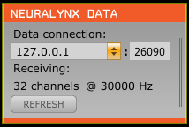

# Neuralynx Open Ephys Plugin 

Plugin for the Open Ephys GUI to read data from Nerualynx systems such as ATLAS and Digital Lynx SX. These systems have a non-publicly-documented duplicated data output that sends UDP packets containing neural data during acquisition. This plugin is a data thread that receives these packets and sends them into an Open Ephys signal chain.

(~The source code and functionality of this program are subject to a non-disclosure agreement (NDA) with Neuralynx, Inc. Contact Neuralynx for access to the NDA and then contact nagra007@umn.edu to obtain access to the private reporsitory.~) 

The terms and conditions have been updated: No longer require an NDA for covering the Open Ephys plugin

Please visit [Neuralynx input plugin](https://github.com/tne-lab/neuralynx-plugin.git) for the code.

## Usage:

With a typical configuration, if the network connection is configured as described above (hidden), the plugin should "just work" - when acquisition has started and data is flowing, it should turn from gray to orange and "Not receiving" should be replaced with "Receiving:" and information about the number of channels and sample rate.
